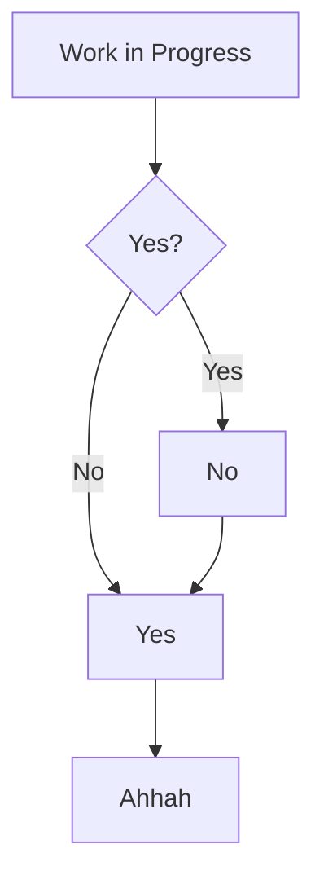

## 🪵Puita
```java
for (int i = 0; i <= 3; i++) {
            System.out.println(" ".repeat((4 - i)) + "*".repeat(1 + i) + "*".repeat(i));
        }
```
___


```mermaid
%%{init: {'theme': ''}}%%
flowchart TB
    A[Work in Progress] --> B{Yes?}
    B -->|Yes| C[No]
    B -->|No| D[Yes]
    C --> D[Yes]
    D --> G[Ahhah]
```
